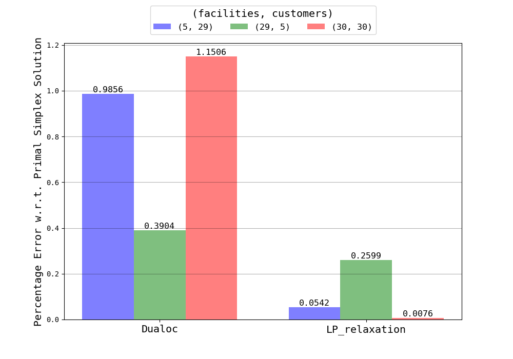
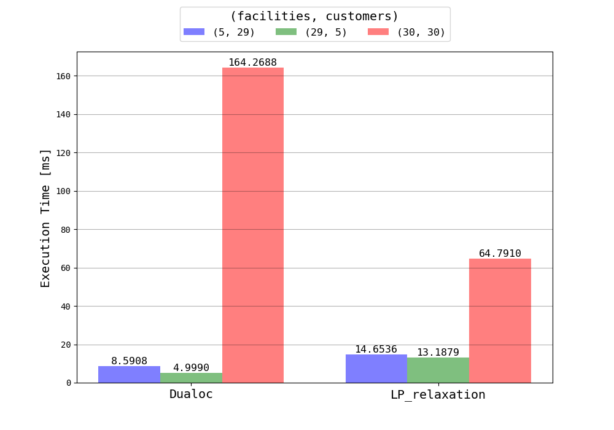

# AMOD's Project

[](https://lgtm.com/projects/g/matt-merman/dualoc/context:python)

# Goal

The aim is to implement:

1. Dual-Based Procedure for Uncapacitated Facility Location (UFL)
2. Subgradient method for Lagrangian Relaxation

# Running

>NOTICE: [Gurobi API](https://www.gurobi.com/free-trial/) have been used to implement Simplex Primal algorithm, Linear Relxation and Lagrangian Relaxation. To run the application you must request the license!

```bash
#Install all the dependencies
python3 -m pip install -r requirements.txt

#Run demo
python3 run.py 3 4

#Run tests
python3 run_test.py
```

# Performance

Some charts:





Others available [here](https://github.com/matt-merman/AMOD/tree/main/src/performance/result)

# Implementation

Please see [presentation](https://github.com/matt-merman/AMOD/tree/main/docs/presentation.pdf) for more details.
